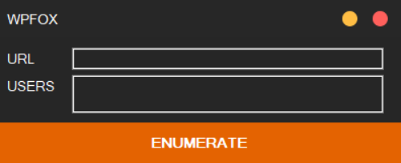

### Welcome to WPFOX version 1.0

This tool will allows you to enumerate all usernames of any wordpress website. it's very simple to use.

### ❗ What is this ?

WPFOX is a tool that allows you to know all the admin usernames of any website that uses wordpress and even if they are hidden. This tool was made for Windows users.

Video Proof: https://youtu.be/Ha1ul1BONB8

### ⚙️ FEATURES

- Admin usernames Enumeration
- Easy to use & it doesn't need knowledge

### 📖 HOW TO INSTALL

1. Download the tool ('https://sellix.io/product/5ff784139208e')
2. Open the WPFOX.exe file
3. copy and past the url with (https://example.com/)
4. press ENUMERATE button.

To learn more please watch this video: https://youtu.be/Ha1ul1BONB8

### 📡 HOW TO UPDATE

You can check updates from our official website:
https://ctoslab.com/products/

For feature recommendation please add it on the "Issues" tab or contact us:
https://www.ctoslab.com/support/

### 💰 Donate

If you like my work, consider buying me a coffee :)

Bitcoin > 17qcsGD3FTckSqHLH4PE4XfRtcktgAZTJm

⚠️ We are not responsible on how you use this tool. 
